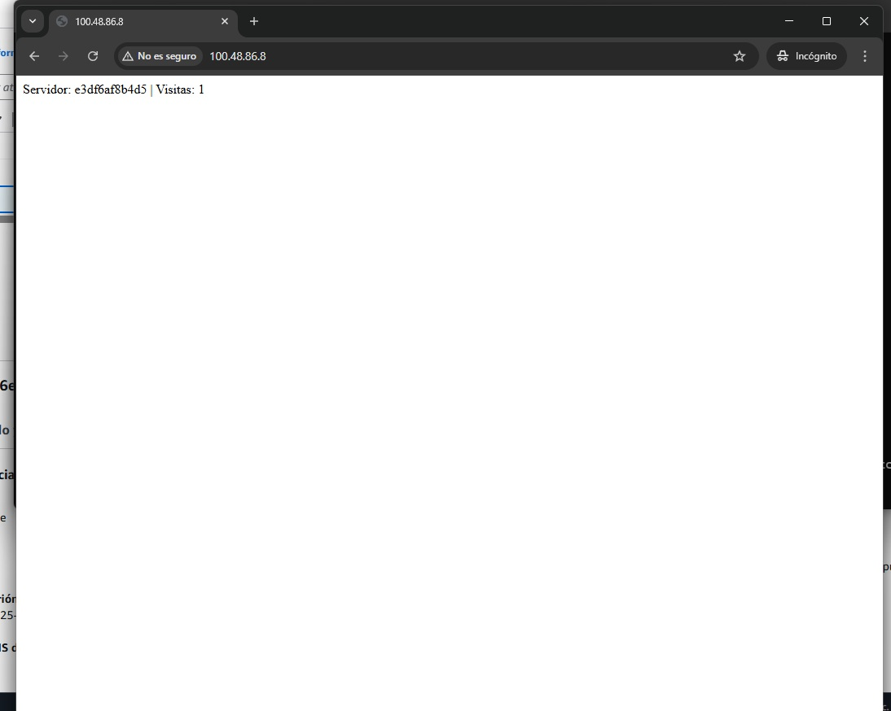
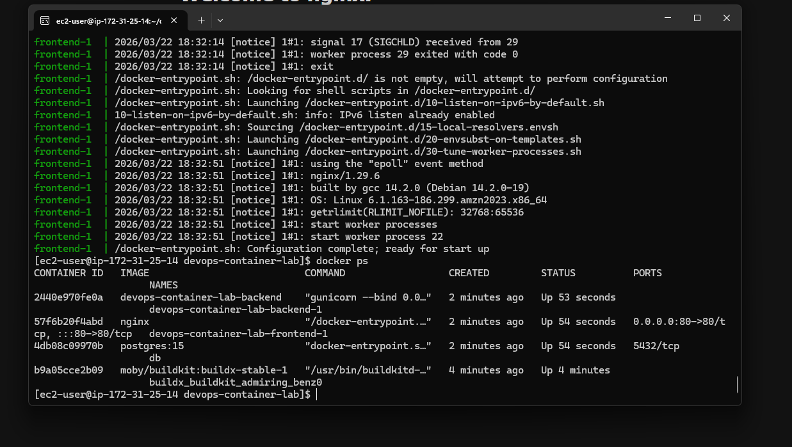
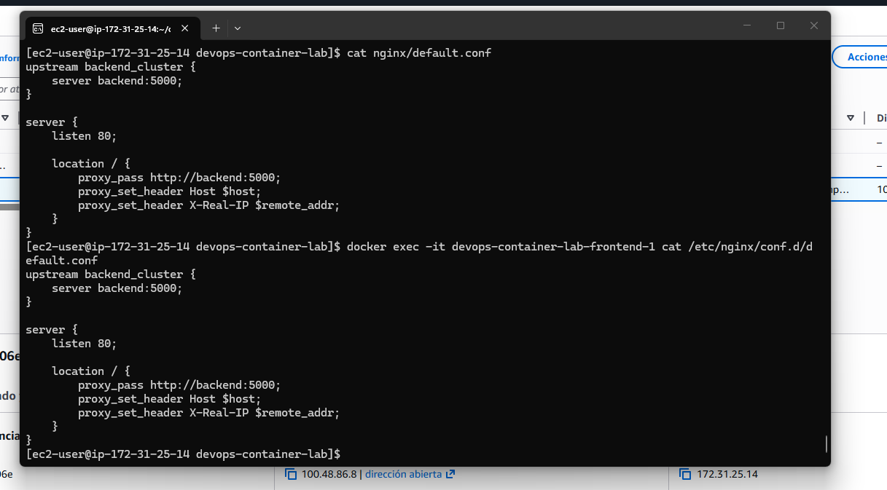
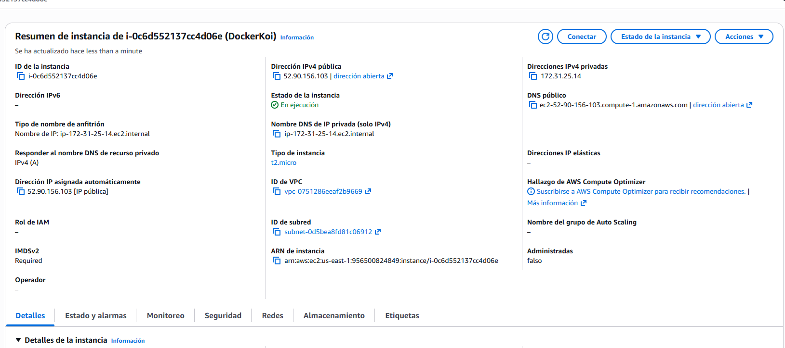

# 🚀 Dockerized Full Stack App on AWS EC2

## 📌 Overview

This project demonstrates how to deploy a containerized application on AWS using Docker and Docker Compose.

It includes:

* Backend (Python + Flask + Gunicorn)
* PostgreSQL database
* Nginx reverse proxy
* Deployment on AWS EC2

---

## 🏗️ Architecture

Internet → Nginx → Backend → PostgreSQL

---

## ⚙️ Technologies Used

* AWS EC2
* Docker
* Docker Compose
* Nginx
* PostgreSQL
* Python (Flask)

---

## 🚀 Deployment Steps

1. Launch EC2 instance (Amazon Linux)
2. Install Docker
3. Copy project to server (scp)
4. Run:

```bash
docker-compose up -d --build
```

5. Access the app via public IP

---

## 🔥 Challenges & Solutions

### ❌ Issue: Database hostname not found

**Error:**

```
could not translate host name "db"
```

**Solution:**
Defined `db` service in `docker-compose.yml`

---

### ❌ Issue: Nginx showing default page

**Solution:**
Configured reverse proxy using custom `default.conf`

---

### ❌ Issue: Docker buildx error

**Solution:**
Disabled BuildKit:

```bash
export DOCKER_BUILDKIT=0
```

---

## 🌐 Live Demo
⚠️ Demo available upon request (instance is stopped to avoid unnecessary costs)

---

## 📸 Screenshots

### 🌐 Application Running



### 🐳 Docker Containers



### 🔁 Nginx Config



### ☁️ AWS EC2



---

## 💡 What I Learned

* Container networking in Docker Compose
* Reverse proxy with Nginx
* Debugging real deployment issues
* AWS EC2 deployment workflow
